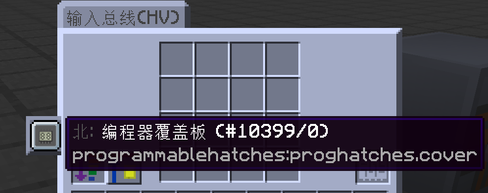
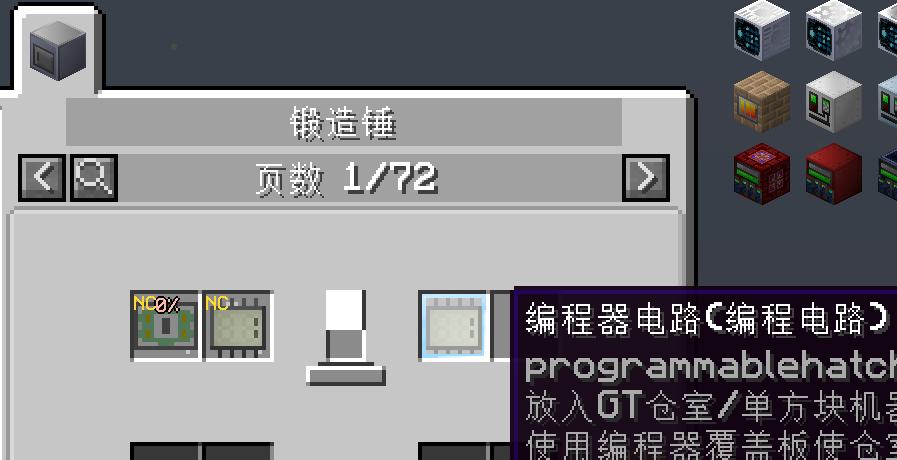
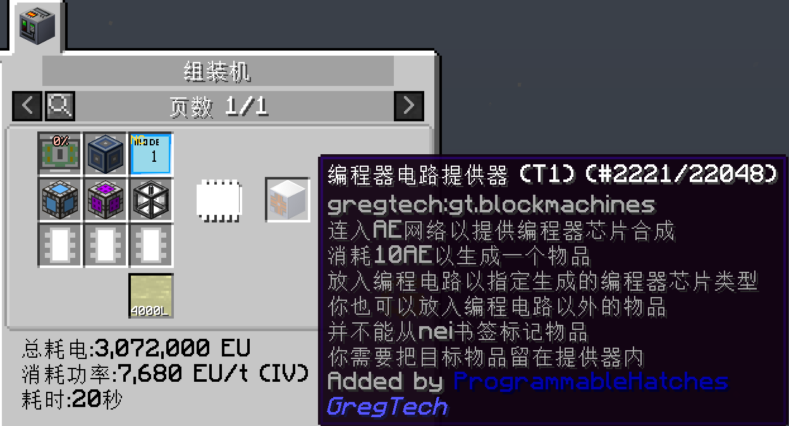
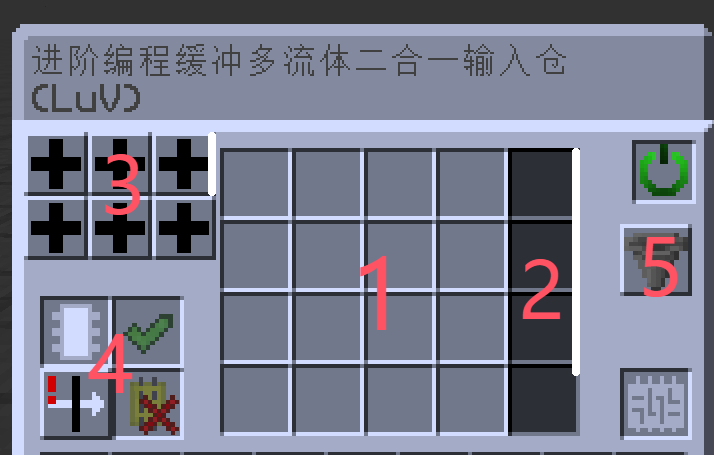

    <h1 align="center">
      
可编程仓室模组

Programmable Hatches Mod

## 介绍

本项目为GT New Horizons整合包的社区MOD，添加了少许能够帮助游戏玩家更方便完成自动化的单方块机器与多方块结构。

注意，该MOD并非GTNH Mod Pack内的官方MOD，讨论此MOD时请注意场合。

如果在安装本MOD游玩的过程中遇到BUG或其他问题，请优先向本代码仓库提交issue而不是GTNH官方提交！

或者自行备份后移除本mod后确认问题不是来自本mod，再向官方提交。

提交issue必要时请附带复现方式与相关报错log。

## MOD安装须知

### Mod下载与版本

请在Github界面的[Releases](https://github.com/reobf/Programmable-Hatches-Mod/releases)处下载本Mod。

其中你需要注意的是：

本Mod目前正在维护的版本支持GTNH整合包 2.7.0版本，不支持GTNH整合包 2.5.0 及以下的版本。

若最新版Mod不能在支持的整合包版本运行,请提issue。

同时，本Mod对2.6.0与2.6.1的支持已经终止，最后一个明确支持2.6.0与2.6.1的版本是v0.0.20，之后的版本不可能在2.7.0以下的版本运行。

本Mod对2.5.1的支持已经终止，v0.0.18p28是最后一个明确支持2.5.1的版本，尽管在此之后的版本可能可以在2.5.1正常运行，但原则上不再处理仅在2.5.1出现的不兼容问题。

### 关于MOD语言

在游戏安装本Mod后会基于你当前的游戏语言向GregTech.lang文件内写入相应的翻译条目，而写入后将无法自动移除条目。

因此你需要事先设置好你的游戏语言再安装此Mod。

如果在运行过mod之后想更改语言，且启用了UseThisFileAsLanguageFile=true，则你需要删除GregTech.lang，或者恢复安装mod前的GregTech.lang的备份（若有）。

## 内容与特性

### 可编程的仓室

本Mod主要功能为能够让玩家便捷的完成自动化，而GTNH中的虚拟电路板总是让AE接管的自动化变得繁琐。

本Mod为此提供了编程器覆盖板，以及多种电压等级与容量的可编程二合一输入仓，具体功能与GTNH自带的输入总线与总成功能相似，但有以下特性。

#### 可更改电路板设置

  

`电路覆盖板`

将编程器覆盖板覆盖至GTNH原版输入总线后，该输入总线将能够识别总线内的编程器电路，并将该总线的虚拟编程电路设置为与编程器电路相同的电路，同时消耗该编程电路。

除了原版输入总线外，GT单方块小机器也能覆盖该覆盖板做到快速更改虚拟电路板的目的。

同时，本Mod所提供的二合一输入仓无需该覆盖板，其自带电路板变更功能。

#### 编程电路的制作

本Mod为各个电压阶段设置了不同的可编程电路制作手段，在一开始，你可以使用锻造锤进行制作编程电路。

  

`锻造锤制作编程电路`

除此之外，你可以使用编程器电路提供器方便快捷的合成编程电路，该提供器需要连接至AE网络，并且需要合成处理器才可以使用，合成速度取决于你的合成处理器并行数量。

  

`电路提供器T1`

除了T1级别的提供器外，还有更多级别的提供器，同时还有自带模板无需放入物品的预购电路提供器，具体请在NEI内搜索并查看其Tooltips进行了解。

除了电路板外，其他物品例如催化剂等在配方中不被消耗的物品也能制作为编程电路，如果同时需要虚拟电路和催化剂，可以配合本Mod的多电路槽仓室使用。

#### 如何将编程电路编入样板

在编写AE样板时，你可以携带编程工具箱进行样板编写，编程工具箱可以按住Shift + 右键切换模式，其中各个模式的功能如下：

* 模式1：将禁用编程工具箱，此时携带编程工具箱在身上时无法触发任何功能。
* 模式2：将开启不消耗物品自动编入模式，在该模式下，只要你将工具箱放在身上的物品栏内，使用NEI转写配方将把所有不被消耗的物品以编程电路形式编入样板。
* 模式3：与模式2几乎相同，但如果该配方没有需要任何不消耗的物品，那么会生成一个将电路板重置为零的编程电路编入样板。

### 编程二合一输入仓

该输入仓与游戏内的总成作用类似，可以单方块向多方块机器提供配方所需的物品与液体，同时也支持电路编程功能，该输入仓有着多种电压等级版本与升级的缓冲版本。

根据其用途和造价，拥有以下版本的编程二合一输入仓。

* 编程二合一输入仓：没有缓存，只有一个流体输入槽和物品槽的二合一输入仓，电压等级越高，可以输入的物品数量和流体数量越多。

* 编程多流体二合一输入仓：与非多流体的编程二合一输入仓相比，将支持更多种类流体输入，其支持的流体数量取决于电压等级。

* 编程缓冲二合一输入仓：与编程二合一输入仓相比，可以进行物品缓存，多方块机器将优先读取缓存内的物品与流体进行配方合成，同时缓存通常是一次最大输入量的4倍，使用缓冲二合一输入仓有利于充分利用多方块机器的并行。

* 编程缓冲多流体二合一输入仓：与非多流体的缓冲二合一输入仓相比，可以输入多种流体。

* 进阶编程多流体二合一输入仓：与非进阶版本的缓冲多流体二合一输入仓相比，可以存储更多种类的缓存，不同的缓存仓互相隔离，即无法跨配缓存读取物品和流体，使用进阶版本的二合一输入仓有利于解决订单切换导致机器并行无法有效利用问题。

这里我们以Luv级别的进阶编程缓冲多流体输入仓进行演示。

  

`进阶编程多流体二合一输入仓Luv`

* 位置1：物品输入界面。

* 位置2：流体输入界面。

其中位置1可存储的物品数量基于电压等级设置，在ME接口向内发送物品时，将不受物品的最大堆叠限制，例如Luv等级的进阶编程缓冲多流体输入仓每格将可堆叠512个物品，EV等级只能堆叠128个物品，

位置2可存储的流体数量设定与位置1相同，但需要注意的是，在非缓冲版本的二合一输入仓只能输入一种流体，而带缓冲的版本随着电压等级的升高可以存储更多种类型的流体，例如Luv缓冲多流体二合一输入仓将可以同时输入5种流体，并且每种流体可以存储64000L，进阶版本的Luv缓冲二合一输入仓流体可输入总数不变，但容量变为512000L.

* 位置3：缓存界面

如果你使用的是带缓冲的二合一输入仓，那么位于位置1与位置2的物品或流体会在1tick后被输送到缓冲，此时多方块结构将优先读取0缓冲位置的物品与流体，缓冲内部将有4倍与外部标识的容量。

需要注意的是，虽然通常玩家会发现缓存内的容量十分巨大，但是处理超大订单时总是出现卡单问题，这是因为外部缓存接受位置的输入量只有缓存内的四分之一，所以编写样板时请注意你的流体数量是否超过了输入仓的最大可接受值，同时注意开启ME接口的阻挡模式，如果不幸发生内部物品乱窜现象，请使用本Mod的ME搋子抽回AE网络。

* 位置4：进阶可编程缓冲二合一输入仓的一些可调整设定

在这里，你可以

>设置是否使用可编程电路模式。
  
>设置是否锁定流体只能存储与位置2中的单格位置，通常情况下，该二合一的流体仓如同GTNH的四重输入仓一样，单种流体在AE发配时无论数量再多，也只能存储在一个格子内部，在二合一输入仓内取消锁定后，单种流体可以在发配时使用多个格子存储。

>设置是否打开输入过滤模式，该设置与普通输入总线的输入过滤模式相同，即该机器的所有配方均无法利用的物品将无法朝内输入。

>输入隔离模式无法被切换。

* 位置5

由于放入缓冲输入面板的物品很快会进入缓存，所以手动放入物品进行合成几乎无法做到，同时你也无法一次性将几组物品放入一个格子里，所以你可以将在5位置处将电源关闭，然后使用插入功能手动向输入面板放置物品，然后再打开电源使物品进入缓存。

#### 其他类型的二合一输入仓

为了解决后期单个配方太大的问题，添加了可以输入超多流体的超级流体二合一输入仓，可以输入10,000,000L*24的流体。

同时还添加了可以使用编程电路的编程样板总线和总成，以及对应的镜像仓室。

除此之外，还有更多功能的特殊仓室请在游戏内搜索。

### 其他实用装置和物品

* ME超级缸/超级箱

与超级缸超级箱功能类似，但是可以直接接入AE网络内，且不需要ME存储总线。

* ME接口覆盖板

与ME接口功能一致，但是能够直接覆盖在机器上，支持二合一和P2P版本。

* 电力原料分配器

解决装配线自动化难题的好办法，具体使用方式游戏内查看tooltips。

* OC扩展部件

增加了少许Open Computer Mod的使用部件，例如能够访问GT高级无线红石的高级无线红石卡，提供矿典访问与数字和字符串ID转换的API卡等扩展，具体内容请在NEI搜索。

>更多内容请在游戏内探索，如果对于某些内容产生文本理解疑惑，可前去B站进行搜索相关视频教程。

## 兼容性

目前本Mod明确支持GTNH官方版本的所有内容，如果你发现某个仓室无法在某机器上工作，那么该机器本身就不支持总成，除非注入并破坏该机器原本的代码，或者GTNH官方进行修复，不然无法兼容，但是你也还是可以提出相关issue，便于排查问题所在。

同时对于其他社区Mod例如Twist Space Technology Mod的支持可能不全面与不及时，如果你发现与其他Mod发生兼容性问题请提交issue。
